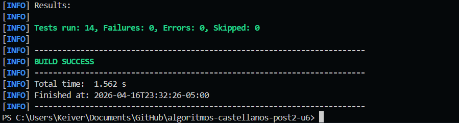
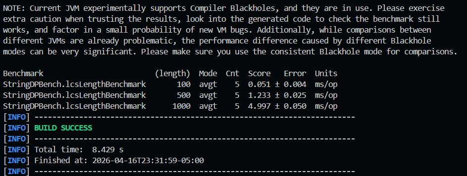

# algoritmos-castellanos-post2-u6

Post-Contenido 2 - Unidad 6  
Analisis y Diseno de Algoritmos - UDES  
Ingenieria de Sistemas - 2026

## Objetivo

Implementar en Java 17+ (compatible con Java 21) los algoritmos de Programacion Dinamica y optimizacion solicitados en la guia:

- LCS (longitud y reconstruccion de subsecuencia)
- Edit Distance (distancia y reconstruccion de alineamiento)
- Floyd-Warshall (all-pairs shortest path con deteccion de ciclos negativos y reconstruccion de camino)
- Versiones de memoria optimizada O(min(n,m)) para LCS y Edit Distance
- Validacion con JUnit 5 y medicion empirica con JMH

## Estructura del proyecto

```text
algoritmos-castellanos-post2-u6/
├── README.md
├── pom.xml
├── capturas/
│   ├── benchmark.png
│   └── test.png
└── src/
	├── main/java/dp/
	│   ├── StringDP.java
	│   ├── FloydWarshall.java
	│   └── bench/StringDPBench.java
	└── test/java/dp/
		├── StringDPTest.java
		└── FloydWarshallTest.java
```

## Requisitos

- Java 17+ (probado con Java 21)
- Maven 3.9+

## Dependencias

- JUnit Jupiter 5.10.0
- JMH 1.37

## Comandos de ejecucion

Compilar:

```bash
mvn compile
```

Ejecutar pruebas:

```bash
mvn test
```

Empaquetar limpio:

```bash
mvn clean package
```

Ejecutar benchmark JMH (modo sin fork para este entorno):

```bash
mvn -DskipTests compile exec:java "-Dexec.mainClass=org.openjdk.jmh.Main" "-Dexec.args=dp.bench.StringDPBench.lcsLengthBenchmark -wi 3 -i 5 -f 0 -r 300ms -w 300ms"
```

## Resultados de benchmark (LCS)

Entorno de prueba:

- JDK 21.0.8
- JMH 1.37
- Benchmark: `StringDPBench.lcsLengthBenchmark`
- Cadenas aleatorias de igual longitud

| Longitud | Tiempo promedio (ms/op) | Error (ms) |
| -------- | ----------------------: | ---------: |
| 100      |                   0.051 |   +- 0.004 |
| 500      |                   1.233 |   +- 0.025 |
| 1000     |                   4.997 |   +- 0.050 |

## Analisis empirico vs complejidad teorica

La complejidad teorica del algoritmo LCS implementado con tabla completa es O(n*m) en tiempo y O(n*m) en espacio. En este benchmark se midio el caso simetrico donde n=m=L, por lo que el tiempo esperado se comporta aproximadamente como O(L^2). Los datos experimentales son consistentes con esta prediccion: al pasar de 100 a 500 caracteres (factor 5 en el tamano), el tiempo sube de 0.051 ms a 1.233 ms (aprox. factor 24.2), muy cercano a 5^2=25. Al pasar de 500 a 1000 caracteres (factor 2), el tiempo crece de 1.233 ms a 4.997 ms (aprox. factor 4.05), alineado con 2^2=4. Esta cercania sugiere que, para los rangos medidos, domina claramente el termino cuadratico de la recurrencia DP y que los costos constantes (overhead del entorno, gestion de memoria y calentamiento de JIT) no alteran la tendencia principal. Adicionalmente, las varianzas reportadas por JMH son bajas, por lo que la estabilidad de la medicion es adecuada para una conclusion academica: el crecimiento temporal observado confirma la expectativa teorica cuadratica de LCS en entradas de longitudes iguales.

## Capturas

### Ejecucion de pruebas (mvn test)



### Salida de benchmark JMH



## Historial de commits relevantes

- `chore: estructura Maven base con JUnit5 y JMH`
- `feat: LCS completo, reconstruccion y version O(min) con pruebas`
- `feat: EditDistance con reconstruccion de alineamiento`
- `feat: FloydWarshall con deteccion de ciclos y reconstruccion`
- `test: FloydWarshall ciclos negativos`
- `perf: benchmark JMH para LCS`
